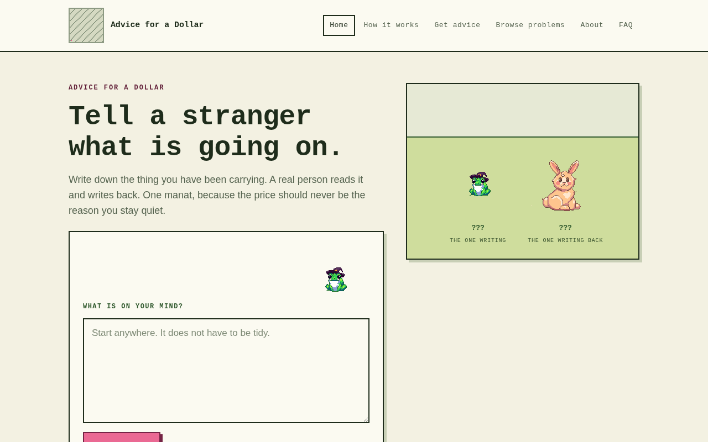
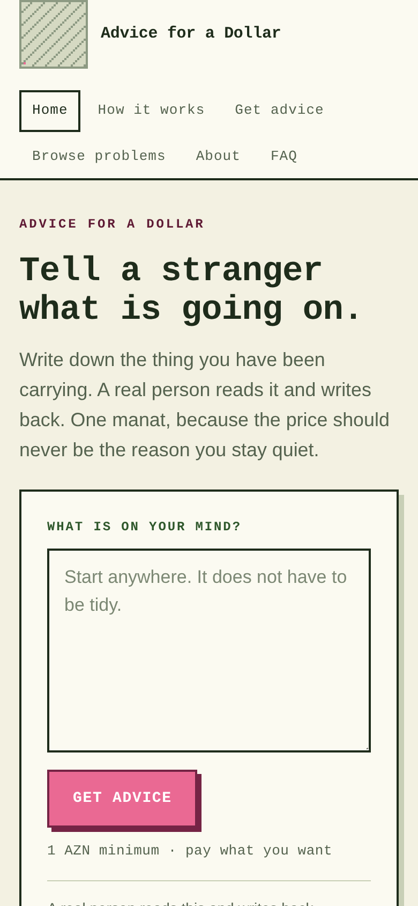
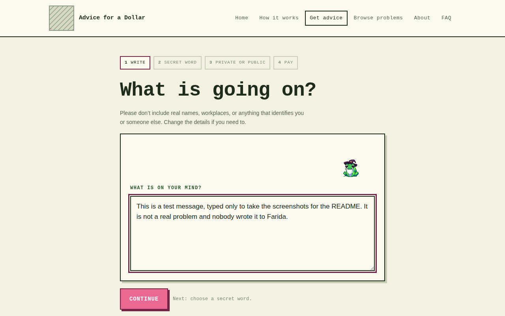
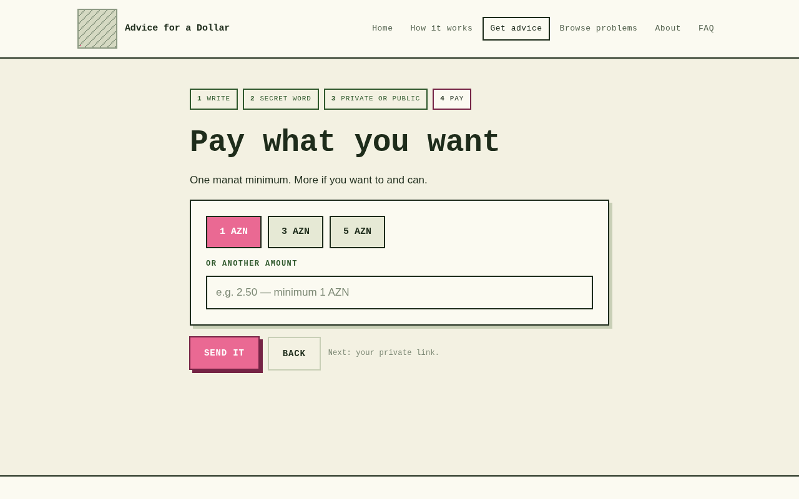
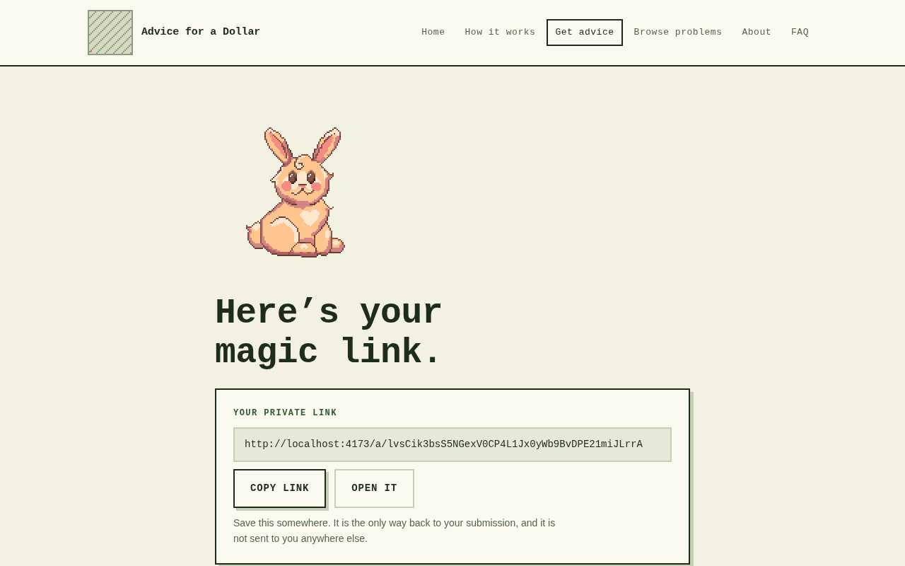
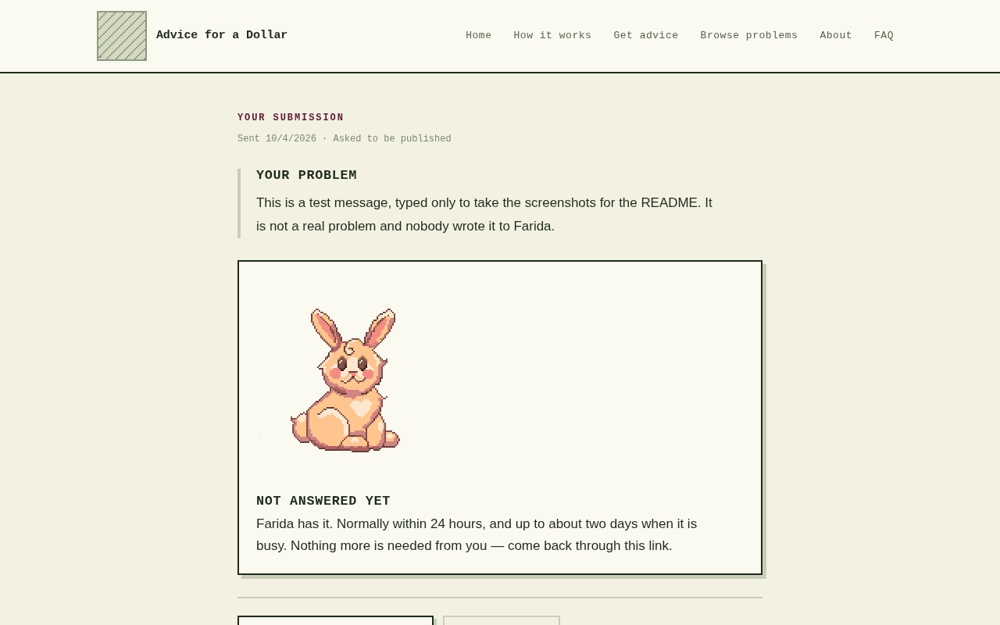
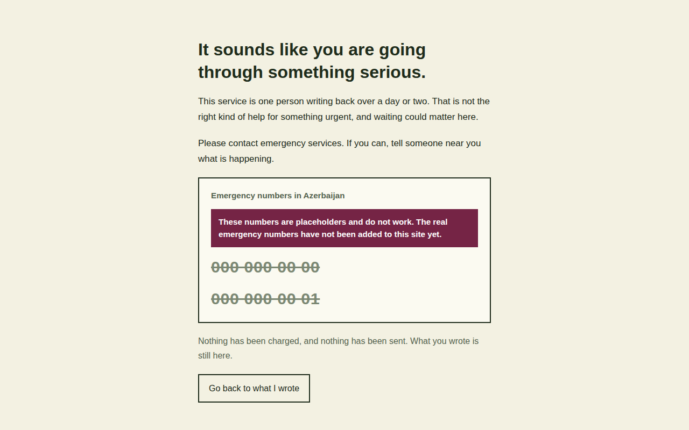
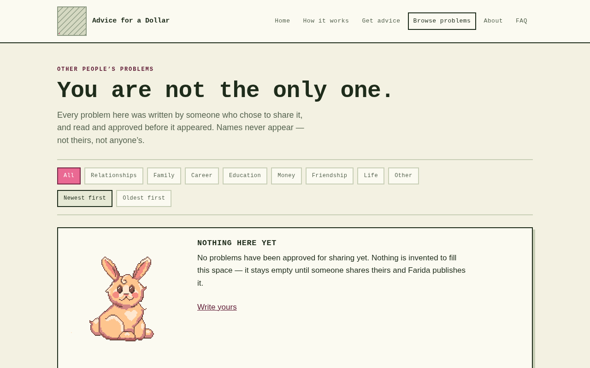
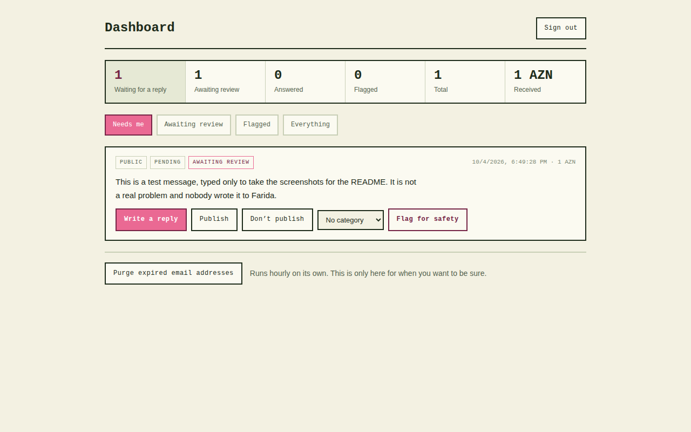

# Advice for a Dollar

[](https://github.com/faridamammadli17-tech/advice_for_a_dollar/actions/workflows/checks.yml)

A one-person advice service. Someone writes down a problem, anonymously, pays
one manat (1 AZN), and Farida writes back personally. Problems that the writer
chose to share, and that Farida approved, appear in a public archive so other
people feel less alone.

It is built to feel playful, warm and human: pixel art, two characters, and a
little ceremony when a letter is sent. It must never feel clinical, like a
corporate product, or like a machine wrote the reply. **No advice on this site
is ever generated by AI.** Only Farida writes answers.

**Status:** working end to end, with a pretend payment provider, so nothing
is charged yet. A short list of things is still needed before it can go live.
It is at the bottom of this page.

---

## What it looks like

<table>
  <tr>
    <td width="66%"></td>
    <td width="34%"></td>
  </tr>
  <tr>
    <td>The home page. You can start writing immediately.</td>
    <td>The same page on a phone.</td>
  </tr>
</table>

<table>
  <tr>
    <td width="50%"></td>
    <td width="50%"></td>
  </tr>
  <tr>
    <td>Four steps: write, choose a secret word, private or public, pay.</td>
    <td>Pay what you want, from one manat.</td>
  </tr>
  <tr>
    <td width="50%"></td>
    <td width="50%"></td>
  </tr>
  <tr>
    <td>After sending, the visitor gets a private link. It is the only way back.</td>
    <td>Their page, waiting for the reply. From here they can also delete everything.</td>
  </tr>
  <tr>
    <td width="50%"></td>
    <td width="50%"></td>
  </tr>
  <tr>
    <td>If a message describes a crisis, the flow stops here, before payment. Deliberately plain. The numbers are placeholders until Farida supplies the real ones.</td>
    <td>The public archive. It stays empty until a real problem is shared and approved. Nothing is invented to fill it.</td>
  </tr>
</table>

<table>
  <tr>
    <td></td>
  </tr>
  <tr>
    <td>Farida's dashboard. It opens on what needs her. The entry shown is a test message typed for this screenshot.</td>
  </tr>
</table>

---

## What it does

**A visitor can**

- write a problem, with their words saved as a draft while they type
- be stopped, gently and before paying, if what they wrote describes a crisis
- choose a secret word, and choose whether the problem may be published
- pay what they want, from one manat
- receive a private "magic link" to their own page
- read the reply, send one follow-up, and delete everything at any time
- recover a lost link with the secret word plus roughly when they wrote

**Farida can**

- sign in at `/admin` with a single password
- read what is waiting, write replies, and reply once to a follow-up
- publish or decline each problem the writer offered for sharing
- give problems a category, flag anything unsafe, and see simple statistics

**Rules the code enforces, not just promises**

- Safety screening runs on the server before anything is created or charged.
- A problem is public only if the writer asked, Farida approved, it is not
  flagged, and it has an answer. The database itself enforces this.
- Farida never edits what someone wrote. The dashboard has no way to do it.
- Secret words are stored scrambled (hashed) and never shown to anyone.
- Recovering a lost link never reveals whether a submission exists.
- No AI anywhere in the replies, the examples, or the archive.

---

## Run it on your own computer

You need **Node.js 22 or newer**, a free download from
[nodejs.org](https://nodejs.org). Everything else comes with the project.

**First time only**, in a terminal, inside the project folder:

```bash
npm install
```

**Every time**, open two terminal windows in the project folder.

Window 1, the server (the database and the API):

```bash
npm run server
```

Window 2, the website:

```bash
npm run dev
```

Then open **http://localhost:5173** in your browser. To stop either one, click
its window and press `Ctrl` + `C`.

Payments run on a pretend provider while the real ones are being set up:
the whole flow works, but no money moves.

### Getting into the dashboard

The dashboard at **http://localhost:5173/admin** is where replies are written.
Set a password once:

```bash
npm run admin:hash
```

Type a password of at least 12 characters. It prints two lines. Create a file
called `.env` in the project folder (there is a template called
`.env.example`) and paste the two lines in. Restart the server, then sign in
at `/admin` with the password you typed.

The password itself is never saved anywhere. Keep it in a password manager.
If it is lost, run the command again to set a new one.

### Backing up

Everything, every submission, reply and payment record, lives in one file:
`data/advice.db`. To back up, stop the server, then copy that file somewhere
safe. That file is deliberately kept out of GitHub.

---

## What is still needed before launch

| What | Who | Why it matters |
| --- | --- | --- |
| The real emergency numbers, with labels | Farida | Shown on the safety screen. Until they are in, the release build refuses to run, on purpose. |
| Her age, for the "Why one manat?" paragraph | Farida | Or the line can be rewritten without it. Also blocks the release build. |
| A real problem and reply for the home page example | Farida | The slot is empty on purpose. A made-up example would be worse than a gap. |
| The forest background scene | Her artist | The home page currently shows a bounded stage instead of a full scene. |
| Epoint or Payriff API documentation | The payment provider | Real payments cannot be wired safely without it. The code refuses to guess. |
| Connecting email | A developer | The mailer is written but not switched on: "your answer is ready" and sending a recovered link to an inbox. |
| Animation frames for the bunny | Her artist | Both characters work as single images today. |

---

## Every command

| Command | What it does |
| --- | --- |
| `npm run dev` | the website, on port 5173 |
| `npm run server` | the API and database, on port 8787 |
| `npm test` | all 133 tests |
| `npm run typecheck` | checks the code for type mistakes |
| `npm run lint` | checks code style |
| `npm run build` | builds for release. **Refuses while anything unsafe is unfinished.** |
| `npm run preflight` | just that safety check, without building |
| `npm run admin:hash` | set the admin password |
| `npm run art:check` | inspect artwork files before they are used |
| `npm run art:recover` | recover pixel art from a clean enlargement |

The release build refuses on purpose while the crisis numbers are placeholders
or the copy still contains an unfilled blank. To build anyway for local
testing only: `ALLOW_PLACEHOLDER_CONTENT=1 npm run build`. That bundle must
not be put online.

---

## Where things are

```
src/            the website (React + TypeScript + Vite)
  content/      every word on the site, including the crisis numbers
  lib/safety/   the crisis screening rules and their tests
  pixel/        the pixel-art engine, and assets/ where artwork goes
  pages/        one file per page
server/         the API (Fastify) and the database (SQLite, built into Node)
  db.ts         the schema, and the rule about what may be published
  app.ts        every route
scripts/        the pre-release safety check and the artwork tools
docs/           the longer documents, and the screenshots above
data/           the database file, created on first run (not in GitHub)
```

## Documentation

- [`docs/HANDOFF.md`](docs/HANDOFF.md): start here if you are picking the
  project up. The rules, the decisions, and the traps.
- [`docs/NOTES.md`](docs/NOTES.md): the full decision log, in order, with the
  reasoning behind every choice.
- [`docs/PROMPT.md`](docs/PROMPT.md): the original brief the project was built
  from. Where it disagrees with the handoff, the handoff wins.
- [`docs/ART_GUIDELINES.md`](docs/ART_GUIDELINES.md): how to deliver pixel art
  intact. Written to be sent to the artist.
